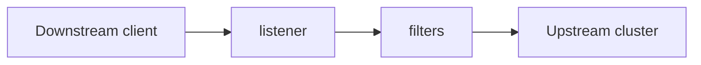
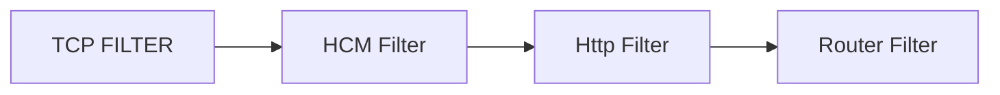

![[Pasted image 20230630115733.png]]
![[Pasted image 20230630124657.png]]

### Filter
it is a piece of code which can perform various function on the incomming request

### Flow of data

### Routing Decision

#### Tcp filters

These tcp filters can read bytes and write bytes 
it has http manager which handles tcp streams in l7

### HCM 
it selects the request
it compares headers to the routing rules and decides the destination

---

## Configuring envoy of 
https://tetrate.io/blog/envoy-101-configuring-envoy-as-a-gateway/

### Admin interface
/stats
/config_dump
/clusters
/logging

<iframe width="560" height="315" src="https://www.youtube.com/embed/40gKzHQWgP0" title="YouTube video player" frameborder="0" allow="accelerometer; autoplay; clipboard-write; encrypted-media; gyroscope; picture-in-picture; web-share" allowfullscreen></iframe>

 ![[Pasted image 20230702150319.png]]
### Downstream and Upstream
downstream is anything below or in frontend of envoy
upstream is anything behind or backend of envoy

#### Cluster
the backend

#### Listener
it is the frontend 
it listens on a port for downstream clients
similar to frontend in HAProxy
there are two filteres applied to listeners tcp/http tls

### Network Filter
filters between layers

#### Threading model 
single process multithreaded application
each thread is bounded to a single connection
and there is no connection between threads

#### Connection Pools
Each host in a cluster gets 1 or more connection pool
each protocol gets a pool HTTP 1.1,HTTP/2
more pool allocate per priority or socket option
connection pools are per worker thread

![[Pasted image 20230702151639.png]]

![[Pasted image 20230702151009.png]]

![[Pasted image 20230702151016.png]]

![[Pasted image 20230702151153.png]]
