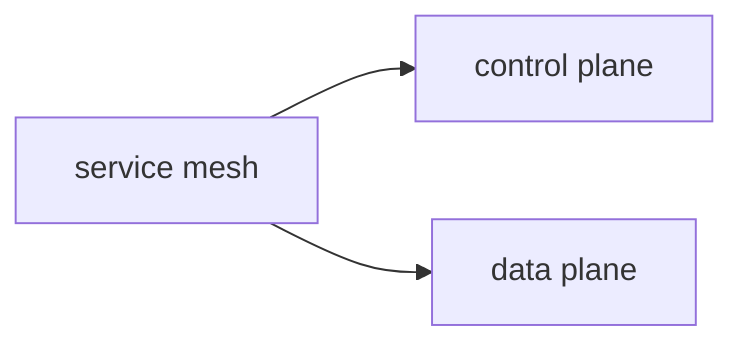

## What is service discovery?

service discovery is finding the things where things are kubernetes solved the problem using services

we need a lot of ilites

## What is service mesh?

service mesh is the way of controlling data, it is an infrasturcture built into appllications

Sidecars are additional containers which does not host our containers but performs additional functions

it is usually divided into two layers

Data plane transfer forward and observing every single data

control plane is like manger , it allows us to apply policies and configurations to the 

### Features of service mesh

#### connect
### secure
### monitor

There is a mutual tls exists between the containers

it does round robin load balancing

it can perform retries

it has traffic shifting which allows us to shift specific percent or specific request to another place

it has circuit breaking
prevents ddos and other 

