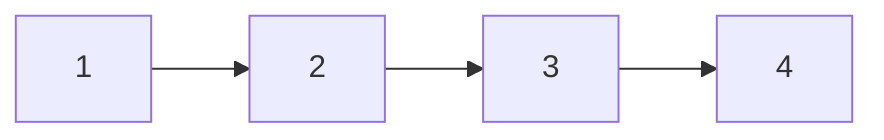

[[Problems Done]]

https://leetcode.com/problems/integer-to-roman/submissions/972620638/
```cpp
class Solution {
public:
    string intToRoman(int num) {
        string roman="";
        vector<int> values={1000,900,500,400,100,90,50,40,10,9,5,4,1};
        vector<string> symbol={"M","CM","D","CD","C","XC","L","XL","X","IX","V","IV","I"};
        for(int i=0;i<values.size();i++){
            while(num>=values[i])
                {num-=values[i];
                roman+=symbol[i];
                }
        }
    return roman;}
    
};
```

we create 2 arrays to map the respective decimal and roman notations
we just map them using for loop and while loop appending into the array


### Reversing Linked List

```cpp
ListNode* rev(ListNode* head){
if(head==null||head->next==null)
	return head;
ListNode* rest=rev(head->next);
head->next->next=head;
head->next=NULL;
return rest;
}
```



----
https://leetcode.com/problems/minimum-number-of-vertices-to-reach-all-nodes/description/

in this problem we are required to get the no of  vertices to reach nodes
so we can simply store the values of the destination-> source in unordered_map and use the mapping to get all the root nodes
(root nodes are not destination nodes)

so we can use a forloop to iterate throughout the items and find all the nodes which do not belong to the hashmap keys

```cpp
class Solution {

public:

vector<int> findSmallestSetOfVertices(int n, vector<vector<int>>& edges) {

unordered_map<int,int> a;

for(int i=0;i<edges.size();i++)

a[edges[i][1]]=edges[i][0];

vector<int> result;

for(int i=0;i<n;i++){

if(!a.count(i))result.push_back(i);

}return result; }

};
```

---

### Keys and rooms

we can simply use bfs to search for rooms which have not been  visited
we mark the variable visited 
and we perform breadth first search by enqueing the keys in each room 

and we mark all the rooms visited

finally we use for loop to check if there is any rooms unvisited in the array.

```cpp
class Solution {

public:

bool canVisitAllRooms(vector<vector<int>>& rooms) {

vector<bool> visited(rooms.size(),false);

queue<int> q;

q.push(0);

while(!q.empty()){

  

int index=q.front();

q.pop();

  

if(visited[index]) continue;

  
  

visited[index]=true;

for(auto keys:rooms[index])q.push(keys);

  

}

for(bool x:visited)

if(!x)

return false;

return true;

}

};

```

---

### Maximum sum of non-adjacent elements

we can use inclusive exclusive method to solve this problem
first we caluculate the sum including the current node and excluding it

```c++
excl1=max(incl,excl);
incl=excl+arr[i];
excl=excl1;
```


### Finding Lowest common ancistor

```cpp
TreeNode<int>* helper(TreeNode<int> *root, int x, int y){

if(root->data==x||root->data==y)return root;

if(!root->left&&!root->right)return NULL;

TreeNode<int> *left=NULL;

TreeNode<int> *right=NULL;

if(root->left)left=helper(root->left,x,y);

if(root->right)right=helper(root->right,x,y);

if(left&&right)

return root;

return left==NULL?right:left;

}

  

int lowestCommonAncestor(TreeNode<int> *root, int x, int y)

{

TreeNode<int> *curr= helper(root,x,y);

return curr->data;

// Write your code here

}
```

we first traverse the entire and store the left and right nodes in respective pointer variables if we forund either of one we return that variable or if we forund both the node we return the current node;

