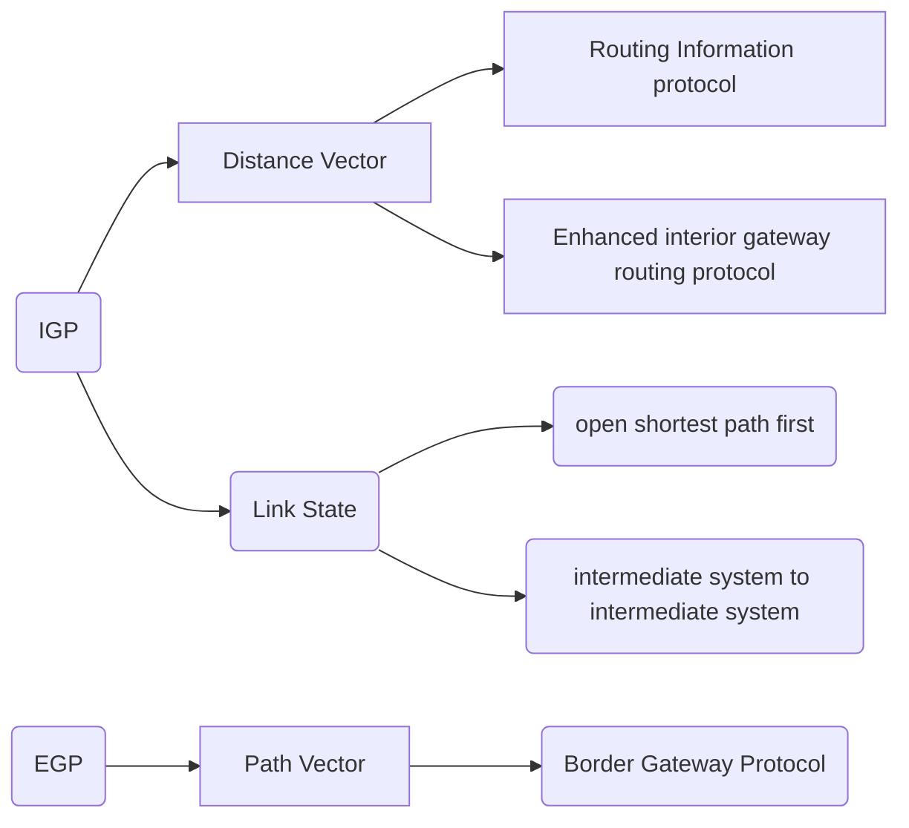

### Network routes are ip addresses denoted with mask </32
### Host route are ip address which points to a specific node

![[Pasted image 20230709120653.png]]

## Different types of routing protocol

 Internal Gateway Protocol (IGP)
 External Gateway Protocol (EGP)

###  External Gateway Protocol (EGP)

border gateway protocol is the current egp

#### Algorithm:
 we use path vector to define nodes in the system

### Internal Gateway Protocol (IGP)

### Algorithm:
Distance Vector and Link State 

## Distance routing protocols

they were discovered before link state protocols
rip and igrp (currently eigrp) are examples

They operate by sending their known destinations and metrics to reach the known destinations to their directly connected neighbors

it is also called as route by rumor

This is because the router doesn't know about the network beyond its neighbor and only knows the information that its neighbors tell

The method is distance vector because the routers only learn the distance and vector of each route.

![[Pasted image 20230709125513.png]]

### Metrics
![[Pasted image 20230709130706.png]]
 ![[Pasted image 20230709131146.png]]

[[Routing Infromation protocol]]
[[Enhanced interior Gateway Routing Protocol]]
[[ospf]]
