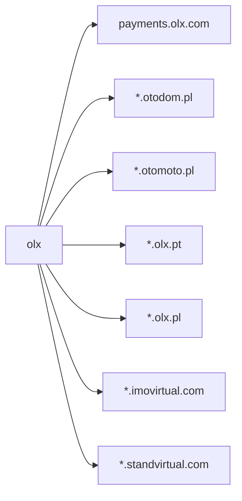

### Scope

```
payments.olx.com
*.otodom.pl
*.otomoto.pl
*.olx.pt	
*.olx.pl	
*.imovirtual.com	
*.standvirtual.com
```



### Htppx
```
on performing httpx on hosts we have found 

  132 httpx200
  149 httpx301
   14 httpx302
    1 httpx308
    2 httpx400
   19 httpx403
   50 httpx404
    3 httpx426
    0 httpx502
  370 total

```


on going through gowitness we have found a site which returns "Apache is functioning normally"

blog.praca.olx.pl

it seems the site have blocklisted me 

so lets target some other sites we may get interest of


prezent.olx.pl
206.189.249.7

this site has a swag instance


https://static.olx.pl/
