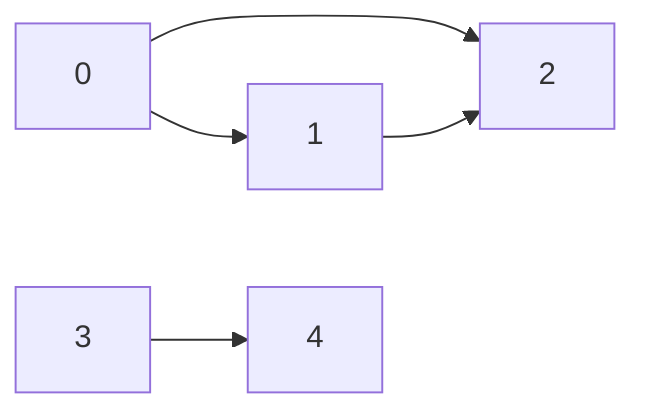
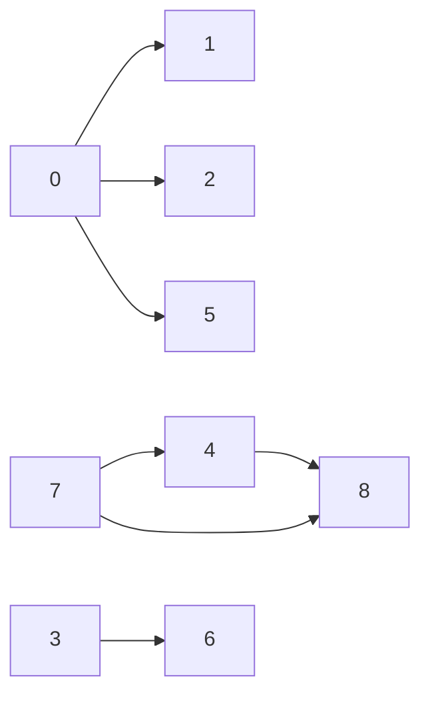
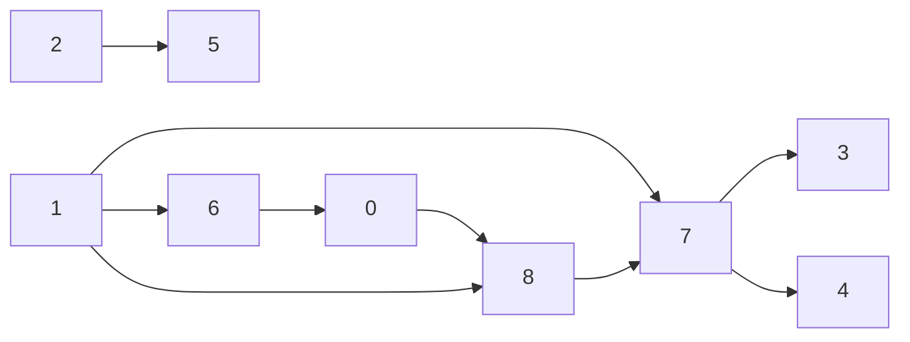

coding ninjas juspay
1)  https://leetcode.com/problems/add-two-numbers/submissions/
 2) https://www.codingninjas.com/codestudio/problems/maximum-sum-of-non-adjacent-elements_843261?leftPanelTab=1
 3) https://www.codingninjas.com/codestudio/problems/0-1-knapsack_920542?leftPanelTab=1
 4) https://www.codingninjas.com/codestudio/problems/tree-traversal_981269?leftPanelTab=1
 5) https://www.codingninjas.com/codestudio/problems/trapping-rainwater_630519
 6) https://www.codingninjas.com/studio/problems/maze-obstacles_977241
 7) https://www.codingninjas.com/studio/problems/lca-of-binary-tree_920541?leftPanelTab=1
 8) 

practice problems
dfs:
https://leetcode.com/problems/minimum-depth-of-binary-tree/submissions/972999027/
https://leetcode.com/problems/sum-of-left-leaves/submissions/973002346/

set
https://leetcode.com/problems/contains-duplicate/submissions/973109532/

bfs:
https://leetcode.com/problems/keys-and-rooms/description/
https://leetcode.com/problems/network-delay-time/submissions/974172028/

graphs:-
https://leetcode.com/problems/network-delay-time/submissions/974172028/

Dinesh sir problems:-

Day3:
1. Maximum Subarray: https://leetcode.com/problems/maximum-subarray/submissions/973670310/
2. https://leetcode.com/problems/largest-rectangle-in-histogram/ to be done
3. 1. Best Time to Buy and Sell Stock

