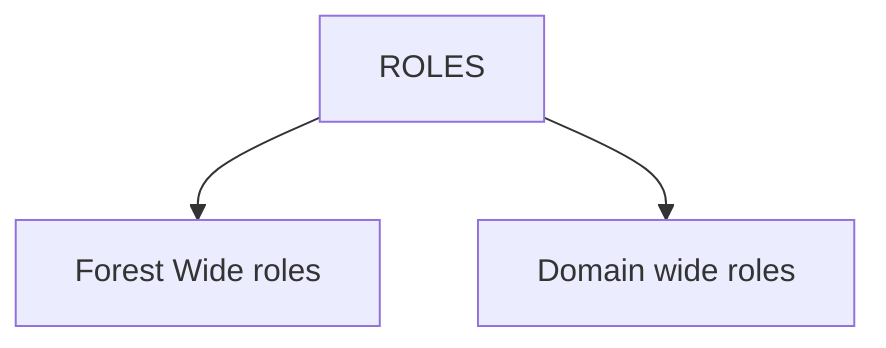
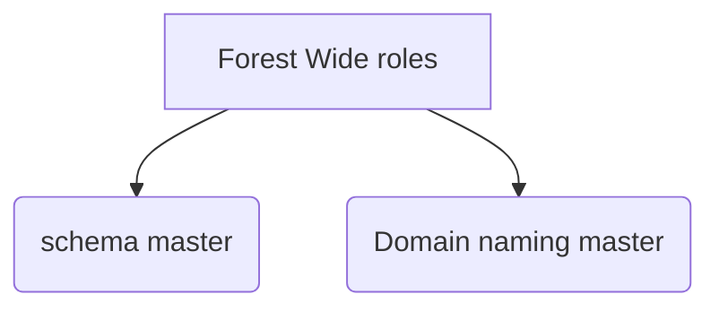
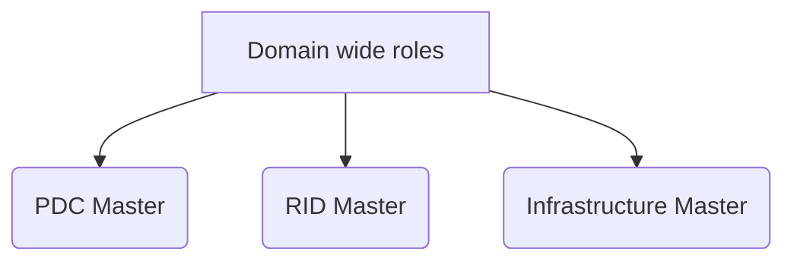

 https://www.youtube.com/watch?v=Tz94PZ1cWDo&list=PLFtZrY0nsVYS2fTvuW7uAGVUqf24fp7NO&index=1&t=28s
 

SAM Db
it is a database used to store username and password 
it is a default database and it is located in C:\\Windows\\system32\\config\\SAM


## Workgroup
all computers in workgroup uses sam  database by default

### Domain Model
The database of Domain model is NTDS
the acronym of NTDS is new technology directory services
it is a manual database
C:\windows\\ntds\\ntds.dit
it stores username and password
It is a centralized Database
![[Pasted image 20230531095839.png]]

### Converting workgroup to Domain
we can convert a workgroup to domain using a active directory domain services

Need for centralised database?
easy administration


 ## work group and Domain

1) What is Domain?
 it is a collection of user server groups and computer uses common database in an organization 
 this organisation is called domain.

![[Pasted image 20230531141235.png]]

here ekascloud.com is domain
ntds is database
kumar and administrator are users


###  Domain controller
A computer running ADDS
A computer with the NTDS Database (exist)

### Adding a computer to domain

step 1: create an user for computer
>	open dsa.msc (Active Directory Users and Computers)
> 	create a new user in  the user folder
> 	![[Pasted image 20230531143817.png]]![[Pasted image 20230531143840.png]]

After inistalling adds domain is first created then domain controller is added

step 2: joining the computer in adds network
>![[Pasted image 20230531143956.png]]
> add the dns ip address into preffered dns on the client machine by following the step
> after that we will be able to join the client machine into active directory domain services
>
>open ncpa.cpl to modify the network settings
> click on the network and open properties
> ![[Pasted image 20230531144357.png]]
> 
> ![[Pasted image 20230531144420.png]]
> set the ip address of the domain controller (dns server)
> open sysdm.cpl
> ![[Pasted image 20230531144538.png]]
> add domain name and the system is added to the active directory domain services
> ![[Pasted image 20230531144642.png]]
> now we can see that the client is added to the domain
> 

users can be added to various groups to get the privilege level for performing various actions withing the limit

   ---
### NTDS.DIT file partitions

Objects:-
accounts in AD Database

There are many types of objects
+ user object (used to login)
+ Group object (to link other object)
+ Computer object (Identify computers in domain)
+ Contact object (Used to store user information)

Classes:-
classes are used to define objects
eg userclass,group class

### Attributes:-
every objects have attributes
there are two types of attributes
mandatory and optional 

example:-
![[Pasted image 20230531184819.png]]
here kumar is object (user)
red: classes
Green: Attributes
Blue: values


### AD schema
Ad schema is a collection of classes and attributes
to get the schema you need to access ad schema file which is located at c:\windows\NTDS\ntds.dit
where ntds is new technolofy directory service directory information tree

#### Types of partition
+ Schema partition
+ Domain partition
+ Configuration Partition
+ Domain DNS Zone Partition
+ Forest DNS Zone Partition

#### Schema partition
This partition contains all classes and attributes

### Domain partition
Domain objects are stored in domain partition

### LDP
it is a tool based on LDAP which allows to view partitions of NTDS.DIT file

---
Types of Domain controller

### Root Domain controller:-
A first Domain Controller in the forest
it is also known as primary/Root DOmain controller

### Additional Domain controller:-
A type of Domain controller in the same domain.
It helps to share the load of RDC and provide fault tolerance
It always joins to an existing domain

ADC holds the replication of RDC 
![[Pasted image 20230531192014.png]]

problems in the above model

huge replication
This can be avoided by using child domain controller

### Child domain controller

A type of Domain controller which create a new child domain  
![[Pasted image 20230531193649.png]]
so after using child domain controller the schema appears like this 

Here we have 3 domains and 4 domain controller

### Tree domain controller
A type of Domain controller which create a new tree domain with new domain and domain dns partition
it always have unique domain name
it follows same schema with different Domain but with different names

### Read only domain controller
A domain controller which has read-only copy of ntds.dit file.

### Trees
collection of domains in the system is called tree
![[Pasted image 20230531200026.png]]


Forest:
collection of trees are called forests  and the forest is identified using root domain controller

----

Revision
What is object in ad?
object is the base element of active directory it represents things on the active directory

what are classes and attributes?
ADDS, class and attributes definition are stored in the directory as instance of the class schema and attribute schema class respectively
what is AD schema?
it it the formal definition of object class and it can be created in an active directory forest.
it contains the definitions of every attribute that can exist in an active directory object


---
### Active directory trust relationship

+ Trust relationship
A relationship between two domains to authenticate and access resources between two domains

+ Nature of Trust
+ Trannsitive and non transitive
![[Pasted image 20230601120206.png]]

+ DIrection of Trust
	OneWay Incomming: User domain
	Oneway Outgoing: Resource domain
    Two way : user/resources

 + Nature of Domains
 + Trusted Domain
 + Trusting Domain

----

### Types of Trust Relationship
//withiin a forest
+ Parent child 
+ Tree Root Trust
+ Shortcut Trust
//outside the forest
+ Forest  Trust
+ External Trust
+ Realm Trust

#### Parent Child 
A type of trust relationship between a parent domain and its child domain 
when you install a new child domain to in an existing tree a new parent child trust is established between parent domain and child domain
it is transitive in nature and two way in nature

we can use Active Directory Domains and Trust (domain.msc) to manage trust relationship between the domains
![[Pasted image 20230601182226.png]]

since jobs.ekascloud.com is a child domain of ekascloud, they always have a two way trust relationship so we will be able to access the resources of child in parent and vise versa


#### Tree Root Trust
A type of trust relationship between tree domain and forest root domain.
when you install a new tree domain in an existing forest, a new tree root trust is established between tree domain and forest root domain by default.
it is transitive and two way in nature.

for example imagine tree root trust as sibling relationship
![[Pasted image 20230601182830.png]]
The above relationship is the example of Tree root truse which entirely depends on transitive nature of the relationship


#### Shortcut trust
A type of relationship manually created by the administrator which can be transitive or non transitive established between tree domain and child domain
It helps to improve the user logon process

![[Pasted image 20230601201849.png]]

#### Forest trust
A type of trust relationship manually created between two forest
it is transitive and can be one or two way


### External trust
trust established between one dc to another dc of different forest is called external tust

---

#### Active directory FSMO Roles

Roles:
roles are classified into two types







for a forest there should be only one schema master and one domain naming master

Except RDC no one can replicate the schema in rdc

Schema Master
> schema master is a Domain controller which hods the schema roles
> it is responsible for replicating creating deleting modifying and upgrading the AD schema in AD Forest.

> A Forest's Root Domain controller is the schema master by default

> Any Domain controller can become a schema master

> There can be only one Schema master in the entire forest.

to get the role detail we can use netdom

![[Pasted image 20230601212854.png]]

we can use ntdsutil to transfer schema master

##### Transfering schema master
firsst connect to the server
```
ntdsutil
ntdsutil: Activate Instance ntds
ntdsutil: roles
fsmo maintanance: connections
server connections: connect to server <server >
fsmo maintanance: transfer schema master
```

### Domain naming master
> Domain naming master is responsible for checking the uniqueness of domain names whenever a new domain is installed in AD forest.

>Forest Root Domain controller is the Domain Naming Master by default

>Any domain controller can become a domain naming master

>there can be only one domain naming master in the entire forest

 ----
## Domain wide roles
these are roles specified within the domains 

#### PDC Master
###### primary domain controller 
It is responsible for forcely updating passwords to all other domain controllers in the domain
it is responsible for updating group policy objects to all domain controllers in the domain
it will synchronise time and all domain controller in the domain
it will update Account lockout policies to all other ADCs whenever a domain controller is locked the user account

### RID Master
###### Relative Id Master
 it is responsible for allocating the relative ID ranges to all ADCs in the domain
 security id is a unique id given to all the objects in the domain
 ![[Pasted image 20230602150354.png]]

### Infrastructure master
it is responsible for updating the group membership to users when users and groups belongs to two different domains

----
Troubleshooting FSMO Roles
What happen when there is no schema master?
	we cannot install ADC,CDC and TDC
	we cannot migrate ADDS lower to higher
	We cannot modify the schema
	We cannot install Exchange server sharepoint etc

What happens when there is no Domain naming master?
it is not possible for checking the uniqueness of domain name

what happens when there is no PDC Master
	password time po account logout cannot be managed

What happen when there is no RID master
we can assign sid

What happens when there is no infrastructure master
	hard for group membership

---

### Global Catalog server
it is enough to have only one gc in a forest

It allows user to search directory information throughout all domain controllers in ADDs forest

it resolves user principle names when authenticating domain controller has no knowledge of the use account

it checks the uniqueness of objects in ADDs forest

it helps infrastructure master to update the group membership to users

it enables universal group meemberships

A new userobject cannot be created without global catalogue server offline

----


### Active Directory Group types and scope

 groups can be viewed in two ways usage and membership
 known as scope of group


### Types of groups in AD
> security groups
> Distribution groups

Security groups 
security groups are used for security and non-security functions
eg:- applying folder and printer permission , sending mail to a group of users

Distribution Groups
used only for non-security functions
Eg:- Sending mail to group of users

Groups

### global group

Membership It allows users from the same domain where the group is created
usage: use global group to access resources of any domain in AD forest


Domain local group

Membership: it allows users from any domain in AD forest
Usage: Use Domain Local group to access resources in the sam domain where group is created


#### AGDLP
Accounts in global group, global group is a member of domain local, domain local has policy permission
The process by which one group members become another group member is called group nesting

----
### Read only domain controller

AD was introduced in windows NT
it was initially called as PDC
(Backup) it had BDC as its backup copy
here pdc is read and write 
bdc is read only

After windows server 2003
the single master replication policy is removed
we started using multi master replication


IN windows server 2008
we started using ADC-RODC
for admain it acts as adc
for authorized person it acts as RODC

